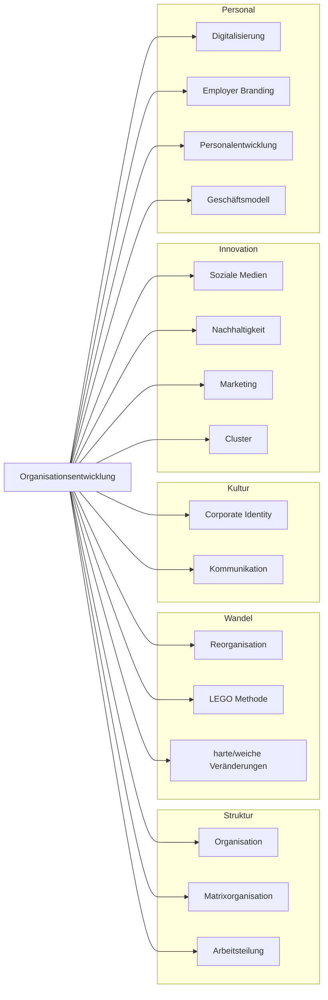

## Ablauf der Lehrveranstaltung 1

**1. Impuls (Einführung):**
- Begriff und Merkmale von Organisationen
- Effektivität vs. Effizienz
- Organisation vs. Unternehmen

**2. Anwendungsphase:**
- Analyse der eigenen fiktiven Organisationseinheit
- Zuordnung der Strukturelemente (Ziele, Mitgliedschaft, Entscheidungswege)
- Diskussion: Hat das System eine Organisation oder ist es eine?

**3. Präsentationsphase:**
- Kurzvorstellung der erarbeiteten Organisationsstruktur
- Reflexion: Inwiefern helfen Strukturmodelle beim Verständnis von Wandel?

---

created: 1.10.2025 | [updated](https://git.jochen-hanisch.de/jochen-hanisch/Professionelle-Praxis/): 16.8.2025 | published: | [Austausch](https://lernen.jochen-hanisch.de/course/view.php?id=4) | [[Hinweise]]

**Der Begriff der Organisation**

---

Modulinhalte

Grundlage der Organisationsgestaltung unter komplexen Bedingungen
Umsetzung einer Analyse als Basis von Organisationsentwicklungsprozessen (Umfeldanalyse, Kontextanalyse, Beispielmethoden) 
Erkennen von Lücken, Bedarf und Sinn / Potentiale für Weiterentwicklungen (Beispielwerkzeuge) 
Relevanz einer Strategie und Positionsbestimmung (Definition von Zielen)
Den Wandel gestalten: Stärkenanalyse, Transformation, Prozesse und Hilfsmittel

---

Themen der Präsentation:
Definition und Merkmale von Organisationen
Grundbegriffe der Organisationsentwicklung
Unterscheidung zwischen Aufbauorganisation und Ablauforganisation
Überblick über Effektivität und Effizienz
Ziel des Termins:
Die Studierenden lernen die Grundlagen der Organisationsentwicklung kennen und erarbeiten die Organisationsstruktur ihrer fiktiven Einrichtung. Sie untersuchen die aktuellen Strukturen und entwickeln erste Überblicksmodelle, um die Basis für die folgenden Termine zu schaffen.
Der Ablauf orientiert sich an einem dreiphasigen Modell: Impuls – Anwendung – Präsentation.

---

(Maier, 2018)

### Flowchart: Struktur der Organisationsentwicklung (nach Springer Gabler)

(Maier, 2018)

---

Organisation- Definition

Der Organisationsbegriff ist vielgestaltig und hängt stark vom theoretischen Kontext ab.

Definitionsvielfalt des Organisationsbegriffs- Organisation ist
die zielorientierte integrative Strukturierung von Ganzheiten oder Gefügesystemen. 
die Strukturierung von Systemen zur Erfüllung von Daueraufgaben. 
ein soziales Gebilde, das dauerhaft ein Ziel verfolgt und eine formale Struktur aufweist, mit deren Hilfe die Aktivitäten der Mitglieder auf das verfolgte Ziel ausgerichtet werden soll. 

---

Merkmale von Organisationen: 
zielgerichtet 
offene soziale Systeme
formale Struktur 
Abgeleitete Definition: 
„Unter einer Organisation ist sowohl das zielorientierte ganzheitliche Gestalten von Beziehungen in offenen sozialen Systemen als auch das Ergebnis dieser Tätigkeit zu verstehen.“

---

### Systemischer Organisationsbegriff (nach Fritz B. Simon)

Organisationen sind aus systemischer Sicht **kommunikative Systeme**, die durch die **Verarbeitung von Entscheidungen** entstehen und sich selbst reproduzieren. Sie existieren, indem sie ständig zwischen **Erwartung** und **Entscheidung** oszillieren.

> „Organisationen organisieren sich nicht – sie organisieren Organisation.“ (Simon, 2007, S. 15)

**Zentrale Merkmale:**
- **Mitgliedschaft:** Wer ist Teil der Organisation und unter welchen Bedingungen?
- **Entscheidung:** Jede Handlung gilt als Entscheidung – und jede Entscheidung erzeugt Folgeentscheidungen.
- **Grenze:** Organisationen grenzen sich nicht durch Personen oder Gebäude, sondern durch Anschlussfähigkeit von Kommunikation ab.

**Reflexionsfrage:**  
Wie verändert sich dein Blick auf Organisation, wenn du sie nicht als *Mittel zum Zweck*, sondern als *Sinn- und Entscheidungsstruktur* verstehst?

---

Effektivität und Effizienz von Organisationen

Eine Organisation ist 
effektiv, wenn sie die richtigen Ziele anstrebt und erreicht.
effizient, wenn sie die richtigen Mittel einsetzt, um die angestrebten Ziele zu erreichen. 

---

Organisation und Unternehmen 

Unter einem Unternehmen wird in der Betriebswirtschaftslehre eine wirtschaftliche, technische, soziale und rechtliche Einheit verstanden, deren Aufgabe die Erstellung und der Absatz von marktfähigen Gütern u./o. Dienstleistungen ist. Alle hierfür erforderlichen Entscheidungen werden von der Unternehmensführung getroffen. Sie trägt die Verantwortung für die gesamte Geschäftstätigkeit und deren Ergebnis. 
Sichtweise I: 	Das Unternehmen hat eine Organisation. 
Sichtweise II:	Das Unternehmen ist eine Organisation.
Aufgabe: Wie unterscheiden sich die meisten Unternehmen der Sozialwirtschaft von der betriebswirtschaftlichen Definition eines Unternehmens?

---

Begriff der Unternehmensführung

Unternehmensführung umfasst die Gesamtheit aller grundlegenden Handlungen, die sich auf die zielgerichtete Steuerung des Unternehmens beziehen. Handlungsträger sind die Mitglieder der obersten Führungsebene.
Personalführung umfasst das unmittelbare Verhältnis zwischen den Vorgesetzten und ihren Mitarbeitern (Führungsstil und Führungsverhalten).
Bei der Unternehmensführung geht es um die Gestaltung und die Steuerung des Gesamtsystems Unternehmen.

---

Organisation als Instrument der Unternehmensführung

Trennung zwischen den Elementarfaktoren und dispositiven Faktoren.
Organisation als Managementfunktion: 
Fünf Managementfunktionen: 

1. Planning 
2. Organizing 
3. Staffing
4. Leading
5. Controlling

---

# Quelle(n)

- Vahs, D. (2019). Organisation: Ein Lehr- und Managementbuch. Stuttgart: Schäffer Poeschel.
- Simon, F. B. (2024). Einführung in die systemische Organisationstheorie (Neunte Auflage). Carl-Auer-Systeme Verlag GmbH.
- Maier, P. D. G. W. (2018, Februar 14). _Definition: Organisationsentwicklung_ [Text]. https://wirtschaftslexikon.gabler.de/definition/organisationsentwicklung-43924; Springer Fachmedien Wiesbaden GmbH.

---
