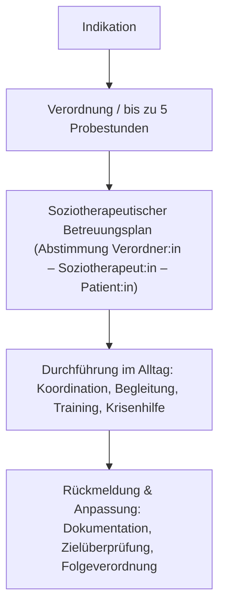

created: 30.8.2025 | [updated](https://git.jochen-hanisch.de/jochen-hanisch/Professionelle-Praxis): 30.8.2025 | published: 30.8.2025 | [Austausch](https://lernen.jochen-hanisch.de/course/view.php?id=4) | [[Hinweise]]

**Rahmenbedingungen der Soziotherapie**

Diese Übersicht stellt die Rahmenbedingungen der Soziotherapie praxisnah und prägnant dar. Sie richtet sich an interessierte Kooperationspartner:innen (Ärzt:innen, Psychotherapeut:innen, Praxen) und vermittelt anschaulich, wie Soziotherapie die therapeutische Arbeit wirkungsvoll ergänzt, Patient:innen stabilisiert und die Versorgung insgesamt entlastet.

> [!abstract] Kurzfassung – in 3 Punkten
>- **Für wen?** Schwer psychisch erkrankte Patient:innen mit deutlichen Fähigkeitsstörungen (Orientierung: GAF ≤ 40, in Einzelfällen bis 50; § 2 ST-RL).
>- **Wie?** Aufsuchende Einzelbegleitung im sozialen Umfeld, abgestimmter Betreuungsplan, Koordination ärztlicher/psychotherapeutischer Maßnahmen, Training von Struktur und Krankheitswahrnehmung, Krisenhilfe.
>- **Welcher Nutzen?** Kontinuierliche Behandlung statt Abbrüche, Entlastung der Praxis, Vermeidung oder Verkürzung stationärer Aufenthalte (§ 1 Abs. 2–3 ST-RL).

# Einleitung

Soziotherapie ist eine Leistung der gesetzlichen Krankenversicherung nach § 37a SGB V. Sie wird in der **Soziotherapie-Richtlinie (ST-RL)** des Gemeinsamen Bundesausschusses geregelt (letzte Änderung: Juli 2025). Ziel ist es, schwer psychisch erkrankte Patient:innen in die Lage zu versetzen, ärztliche und psychotherapeutische Behandlungen kontinuierlich wahrzunehmen. Für Ärzt:innen und Psychotherapeut:innen bedeutet dies: Soziotherapie ergänzt die eigene Arbeit, indem sie die Brücke zwischen Praxis und Alltag der Patient:innen schlägt und Versorgungsausfälle verhindert.

# Definition

Soziotherapie ist die koordinierende und begleitende Leistung für schwer psychisch erkrankte Patient:innen, die aufgrund ihrer Erkrankung nicht in der Lage sind, notwendige medizinische und psychotherapeutische Maßnahmen selbständig wahrzunehmen. Sie umfasst Motivierung, Anleitung und strukturierte Hilfen im sozialen Umfeld, um die Inanspruchnahme der im Behandlungsplan festgelegten Therapien zu ermöglichen und zu sichern. Damit stellt Soziotherapie die strukturierte Schnittstelle zwischen Patient:innen und dem medizinischen Versorgungssystem dar (§ 1 ST-RL; G-BA, 2025).

# Herleitung

Die Herleitung der Soziotherapie erfolgt auf Grundlage der gesetzlichen Bestimmungen und der Soziotherapie-Richtlinie. Für Kooperationspartner:innen ist wesentlich zu verstehen, dass Indikation, Verordnung, Leistungsinhalte und Leistungsumfang klar geregelt sind. Dadurch entsteht für Praxen ein rechtssicherer Rahmen, der Zusammenarbeit strukturiert und verlässlich macht.

## Soziotherapie in 5 Schritten (Schema)

## Indikation

- **Zielgruppe**: Patient:innen mit schweren psychischen Erkrankungen (z. B. Schizophrenien, schizoaffektive Störungen, schwere Depressionen mit psychotischen Symptomen).  
- **Kriterium**: Deutliche Fähigkeitsstörungen, die dazu führen, dass medizinische oder psychotherapeutische Leistungen nicht zuverlässig wahrgenommen werden können (§ 2 ST-RL; G-BA, 2025).  
- **Orientierung**: Global Assessment of Functioning (GAF) ≤ 40, in Einzelfällen bis 50 (American Psychiatric Association, 2000/2003).  
- **Diagnosegruppen**: Schwere psychische Erkrankungen aus dem schizophrenen Formenkreis und den affektiven Störungen mit psychotischen Symptomen sind ausdrücklich erfasst (§ 2 Abs. 4 ST-RL; G-BA, 2025).
- **NUTZEN für Praxen und Patient:innen**: Rückführung von Patient:innen in kontinuierliche Behandlung, Vermeidung von Therapieabbrüchen und Reduktion des Risikos stationärer Aufenthalte.

## Verordnung

- **Verordnungsberechtigte**: Fachärzt:innen für Psychiatrie, Psychotherapie, Neurologie, Psychosomatik sowie Vertragspsychotherapeut:innen (§ 4 ST-RL; G-BA, 2025).  
- **Institutionelle Verordnung**: Psychiatrische Institutsambulanzen können Soziotherapie ebenfalls verordnen.  
- **Probestunden**: Vor regulärer Verordnung sind bis zu 5 Einheiten möglich, um Therapiefähigkeit und Indikation zu prüfen (§ 5 Abs. 2 ST-RL; G-BA, 2025). Diese Probestunden werden auf das Gesamtkontingent angerechnet.  
- **Genehmigung**: Jede Verordnung von Soziotherapie (über 5 Stunden hinaus) bedarf der vorherigen Genehmigung durch die Krankenkasse (§ 9 Abs. 1 ST-RL; G-BA, 2025).  
  Die Genehmigung erfolgt in der Regel auf Grundlage des soziotherapeutischen Betreuungsplans (§ 9 Abs. 1 ST-RL; G-BA, 2025).
- **NUTZEN für Praxen**: Verordnung gibt Ärzt:innen und Therapeut:innen Sicherheit, dass Patient:innen trotz Instabilität kontinuierlich in Behandlung bleiben.

## Leistungsinhalt

- **Betreuungsplan**: Erstellung eines strukturierten soziotherapeutischen Betreuungsplans in Abstimmung mit Verordner:in und Patient:in (§ 3 Abs. 2a ST-RL).  
- **Koordination & Begleitung**: Aktive Hilfe und Anleitung, um ärztliche und psychotherapeutische Maßnahmen zuverlässig in Anspruch zu nehmen (§ 3 Abs. 2b ST-RL).  
- **Soziales Umfeld**: Analyse der häuslichen und sozialen Situation, Einbeziehung von Angehörigen, Heranführung an komplementäre Dienste (§ 3 Abs. 2c ST-RL).  
- **Dokumentation & Rückmeldung**: Fortlaufende Dokumentation von Maßnahmen und Zielen sowie enge Rückmeldung an verordnende Praxis (§ 3 Abs. 2d ST-RL).  
- **NUTZEN für Praxen**: Verlässlichkeit der Patient:innen steigt, Therapieabbrüche werden vermieden, Behandlungsprozesse laufen stabiler.

> [!warning]  Abgrenzung: Was Soziotherapie **nicht** ist
> 
> - keine allgemeine soziale Teilhabe-/Freizeitbegleitung (Aufgabe der Eingliederungshilfe nach SGB IX),  
> - keine pflegerische Behandlung oder Medikamentengabe im Sinne der psychiatrischen häuslichen Krankenpflege (pHKP),  
> - keine eigenständige Zielfindung neben dem ärztlich/psychotherapeutisch gesetzten Behandlungsplan,  
> - keine Doppelstrukturen zu inhaltsgleichen pHKP-Leistungen (Kombination nur ergänzend; § 4 Abs. 8 ST-RL).  
>
> **Kurz:** Soziotherapie ist die strukturierte Schnittstelle zur **Ermöglichung** medizinischer/psychotherapeutischer Behandlung – nicht deren Ersatz.

## Leistungsumfang

- **Kontingent**: Bis zu 120 Stunden innerhalb von drei Jahren pro Krankheitsfall (§ 5 Abs. 1 ST-RL; G-BA, 2025).  
- **Einheiten**: 1 Einheit = 60 Minuten; flexible Aufteilung in kleinere Zeitblöcke möglich (§ 5 Abs. 3 ST-RL).  
- **Setting**: In der Regel Einzelmaßnahmen; in begründeten Ausnahmefällen Gruppensettings (maximal 12 Personen, 90 Minuten) (§ 5 Abs. 4 ST-RL).  
- **NUTZEN für Praxen**: Planbarkeit des Stundenkontingents, flexible Anpassung an individuellen Bedarf, Stabilität in ambulanter Versorgung.

## Zusammenarbeit

- **Abstimmung**: Kontinuierliche enge Kooperation zwischen Verordner:in, Soziotherapeut:in und Krankenkasse, um Versorgungslücken zu vermeiden (§ 8 ST-RL; G-BA, 2025).  
- **Überprüfung**: Regelmäßige Evaluation der Therapieziele mindestens alle zwei Monate; obligatorisch vor und nach Probestunden sowie vor jeder Folgeverordnung (§ 8 Abs. 2 ST-RL; G-BA, 2025).  
- **NUTZEN für Praxen**: Ärzt:innen und Therapeut:innen erhalten verlässliche Rückmeldungen zum Verlauf, was Steuerung der Behandlung erleichtert und Zeitressourcen schont.

# Folgerungen

- **Ergänzung, keine Konkurrenz**: Soziotherapie ergänzt Psychotherapie und medizinische Behandlung, ersetzt diese nicht (§ 1 Abs. 2 ST-RL; G-BA, 2025).  
- **Praxisentlastung**: Ärzt:innen und Psychotherapeut:innen werden entlastet, da Alltagsstrukturierung, Terminorganisation und Motivation übernommen werden.  
- **Kontinuität sichern**: Patient:innen erscheinen verlässlicher in der Praxis in Behandlung; Abbrüche und Unterbrechungen werden reduziert.  
- **Stationäre Aufenthalte vermeiden**: Durch rechtzeitige Stabilisierung im häuslichen Umfeld sinkt Risiko stationärer Einweisungen.  
- **NUTZEN für Kooperationspartner:innen**: Praxen können therapeutische Arbeit fokussierter und wirksamer gestalten, da organisatorisches und motivationales Fundament gesichert ist.

# Zusammenfassung

Soziotherapie ist gesetzlich verankerter Versorgungsbaustein nach § 37a SGB V für schwer psychisch Erkrankte.  
Sie bildet die Brücke zwischen medizinischer Behandlung und dem alltäglichen Leben der Patient:innen, indem sie Struktur, Begleitung und Koordination sicherstellt.  
Für Ärzt:innen und Psychotherapeut:innen bedeutet dies: weniger Therapieabbrüche, verlässlichere Patient:innen in der Praxis und Konzentration auf eigentliche psychotherapeutische und medizinische Arbeit.
Soziotherapie stärkt und sichert bestehende Behandlungsstrukturen (siehe [[Fallvignetten Soziotherapie]]) ab und steigert die Wirksamkeit der ambulanten Versorgung.

# Quelle(n) 

- American Psychiatric Association. (2003). *Diagnostisches und Statistisches Manual psychischer Störungen DSM-IV-TR. Textrevision* (dt. Ausg.). Hogrefe.  
- Gemeinsamer Bundesausschuss. (2025). *Richtlinie über die Durchführung von Soziotherapie in der vertragsärztlichen Versorgung (Soziotherapie-Richtlinie/ST-RL), in der Fassung vom 22. Januar 2015, zuletzt geändert am 15. Mai 2025, in Kraft getreten am 26. Juli 2025.* *Bundesanzeiger*, BAnz AT 25.07.2025 B3.

---

#Soziotherapie #Kooperation #Praxis #Rahmenbedingungen #Psychotherapie #G-BA
